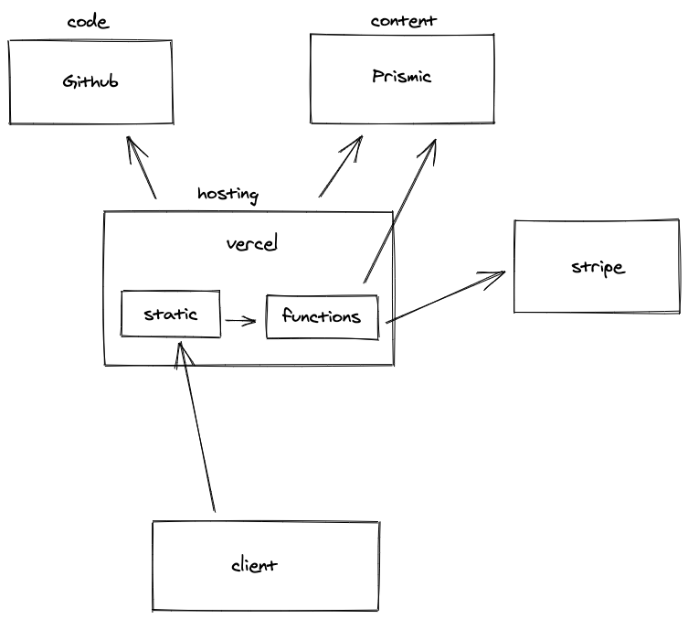

# Checkouts with stripe

- At build time, a script is run which fetches the complete product inventory and stores it as json in `/pages/api/products.json`.
- A user builds a basket of items and clicks the checkout button. The basket state is managed by [use-shopping-cart](https://useshoppingcart.com/).
- The checkout button sends a POST request to a serverless checkout function with quantities and IDs of the cart items
- The function has access to our secret keys for stripe
- The function checks the price, title, description etc of each item against the records in `products.json`, and assembles a new validated cart in the format which stripe accepts.
- Depending on the contents of the basket (ie whether any of the items are silver), shipping costs are added to the basket total.
- The function makes a request to stripe for a unique checkout session with the product details. Stripe responds with a redirect instruction.
- The redirect object is then sent back to the user, sending them to stripe to check out.
